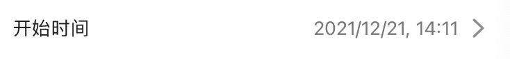

### ImageChooseView

- 效果


- 用法
  编辑模式
```swift

    //图片选择块
    lazy var imageChooseResultView: ImageChooseResultView = {
        let temp = ImageChooseResultView()
        temp.maxImageCount = 9 
        return temp
    }()

//布局
        imageChooseResultView.snp.makeConstraints { make in
            make.left.equalToSuperview()
            make.width.equalToSuperview()
            make.top.equalTo(pictureTitleView.snp.bottom).offset(-10)
            make.height.equalTo(100)
        }

```

不可编辑模式
```swift
    //图片选择块
    lazy var imageChooseResultView: ImageChooseResultView = {
        let temp = ImageChooseResultView()
//        temp.maxImageCount = 0
        temp.isEditable = false
        return temp
    }()

//布局
  imageChooseResultView.snp.makeConstraints { make in
            make.left.equalToSuperview()
            make.width.equalToSuperview()
            make.top.equalTo(pictureTitleView.snp.bottom).offset(-10)
            make.height.equalTo(100)
            
            make.bottom.equalTo(pictrueView.snp.bottom)
        }
        
        let images = fileList.map { item -> OssImageModel in
            let model = OssImageModel()
            
            model.isUpload = true
          
            //oss
            model.fileName = item.fileName ?? ""
            model.ossKey = item.ossKey ?? ""
            model.versionId = item.versionId ?? ""
            
            //id
            model.id = Int(item.id ?? "0") ?? 0
            model.isImg = item.isImg
            model.url = item.url
            
            // 是否加密
            model.isSecret = item.isSecret
            model.dataMapId = item.dataMapId
            
            return model
        }
        imageChooseResultView.Images = images
```

### RowView

- 效果


#### RowBaseView
- 用于行标题
  
```swift
    //项目概述
    lazy var remarkTitleView: RowBaseView = {
        let temp = RowBaseView.rowBaseView("项目概述",isRequire: true)
        return temp
    }()

```

#### RowSelectView
- 用于行选择框
- 效果


```swift
       //项目标签
    var projectTips:[SelectListItem] = [SelectListItem(text: "普通", value: 1),
                                        SelectListItem(text: "加急", value: 2),
                                        SelectListItem(text: "重要", value: 4),
                                        SelectListItem(text: "紧急", value: 8)]
    
    
    lazy var projectTipRow: RowSelectView = {
        let temp = RowSelectView.rowSelectView("项目标签", dataSource: projectTips,isRequire: true)
        return temp
    }()
        
        //布局
        self.scrollView.addSubview(projectTipRow)
        projectTipRow.snp.makeConstraints { make in
            make.left.equalToSuperview()
            make.width.equalToSuperview()
            make.top.equalTo(remarkTextView.snp.bottom).offset(App_Space_Width)
            make.height.equalTo(RowBaseView.RowHeight)
        }

        //验证
            if !self.projectTipRow.valid(){
            MBProgressHUD.showMessage("请选择项目标签")
            return false
        }

        //取值
        self.projectTipRow.getValue()
```


#### RowTextFieldView
- 用于行文本框
- 效果


```swift
    //项目名称
    lazy var titleRow: RowTextFieldView = {
        let temp = RowTextFieldView.rowTextFieldView("项目名称", placeholder: "请输入", showBorder: true, isRequire: true)
        return temp
    }()
        
        //布局
        self.scrollView.addSubview(titleRow)
        titleRow.snp.makeConstraints { make in
            make.left.equalToSuperview()
            make.width.equalToSuperview()
            make.top.equalToSuperview().offset(12)
            make.height.equalTo(RowBaseView.RowHeight)
        }

        //验证
        if !self.titleRow.valid(){
            MBProgressHUD.showMessage("请输入项目名称")
            return false
        }

        //取值
        self.titleRow.getValue()
```


#### RowTimeEditView
- 用于行选择时间框
- 效果


```swift
    //计划时间
    lazy var startTimeView: RowTimeEditView = {
        let temp = RowTimeEditView.rowTimeEditView("计划开始", date: Date(), showBorder: true, isRequire: true)
        return temp
    }()
        
        //布局
        self.scrollView.addSubview(startTimeView)
        startTimeView.snp.makeConstraints { make in
            make.left.equalToSuperview()
            make.width.equalToSuperview()
            make.top.equalToSuperview().offset(12)
            make.height.equalTo(RowBaseView.RowHeight)
        }

        //验证
        if !self.startTimeView.valid(){
            MBProgressHUD.showMessage("请选择计划开始时间")
            return false
        }

        //取值
        self.startTimeView.getValue()
```